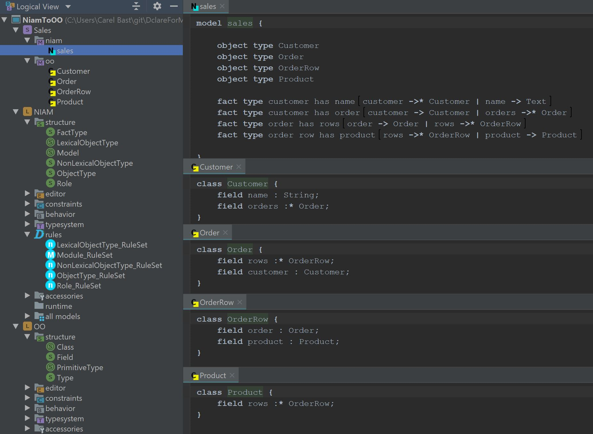

### NiamToOO - a simple Niam to OO transformation

Similar to example 1, this example defines two languages with a transformation:
* a NIAM like language   
* and a very basic OO language  
* Rules are defined to transform NIAM instances into OO instances  
* An example sales model is defined  

Overview of the sales example in NIAM and OO:

